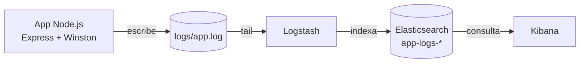

# Laboratorio ELK Stack

Laboratorio educativo que implementa un stack completo **ELK** (Elasticsearch,
Logstash, Kibana) para centralizar y analizar en tiempo real los logs de una
aplicación Node.js.


## Tabla de Contenidos

- [Descripción](#descripción)
- [Características](#características)
- [Requisitos Previos](#requisitos-previos)
- [Instalación](#instalación)
- [Configuración](#configuración)
- [Uso](#uso)
- [Arquitectura](#arquitectura)
- [Stack Tecnológico](#stack-tecnológico)
- [Scripts Disponibles](#scripts-disponibles)
- [Testing](#testing)
- [Contribución](#contribución)
- [Troubleshooting](#troubleshooting)
- [Roadmap](#roadmap)
- [Documentación](#documentación)
- [Soporte](#soporte)
- [Versionado](#versionado)
- [Autores](#autores)
- [Licencia](#licencia)
- [Apóyanos](#apóyanos)
- [Agradecimientos](#agradecimientos)

## Descripción

Este proyecto muestra, de punta a punta, cómo se centralizan y analizan logs con
el stack ELK. Una pequeña API en Node.js emite logs JSON estructurados; Logstash
los lee, parsea y enriquece; Elasticsearch los indexa; y Kibana permite explorar,
visualizar y alertar sobre ellos.

Está pensado como **recurso de aprendizaje**: se levanta con un comando y trae
scripts para verificar el estado y simular tráfico. Para el propósito y a quién
sirve, ver [`docs/product/business-model.md`](docs/product/business-model.md).

### Flujo de Funcionamiento



## Características

- ✅ API Node.js con endpoints que generan logs de distintos niveles (info/warn/error)
- ✅ Logging estructurado en JSON con Winston
- ✅ Pipeline de Logstash con parseo, enriquecimiento y tags
- ✅ Elasticsearch (single-node) con índices diarios `app-logs-YYYY.MM.dd`
- ✅ Kibana para Discover, dashboards y alertas
- ✅ Orquestación completa con Docker Compose
- ✅ Scripts de arranque, verificación y simulación de tráfico

## Requisitos Previos

- **Docker** y **Docker Compose** (v2)
- Al menos **4 GB de RAM** disponibles
- Puertos **5001**, **9200** y **5601** libres
- Terminal con acceso a comandos bash

## Instalación

### 1. Clonar el repositorio

```bash
git clone https://github.com/brayandiazc/stack-elk.git
cd stack-elk
```

### 2. Levantar el stack

```bash
docker-compose up -d
docker-compose ps
```

### 3. (Opcional) Configurar variables de entorno

```bash
cp .env.example .env
# Edita .env si ejecutas la app fuera de Docker
```

## Configuración

Las variables de entorno se documentan en [`.env.example`](.env.example). El stack
funciona sin configuración adicional; las variables son útiles al ejecutar la app
Node.js localmente (`npm start`) fuera de los contenedores.

> Nunca subas tu archivo `.env` con valores reales. Ver [SECURITY.md](SECURITY.md)
> y [`docs/conventions/secrets.md`](docs/conventions/secrets.md).

## Uso

### Verificar servicios

```bash
curl http://localhost:5001/health           # App Node.js
curl http://localhost:9200/_cluster/health  # Elasticsearch
open http://localhost:5601                    # Kibana (navegador)
```

### Simular tráfico

```bash
./simulate-traffic.sh
```

### Ver los logs en Kibana

1. **Stack Management → Index Patterns** → crear `app-logs-*` con `@timestamp`.
2. Ir a **Discover** para ver los logs en tiempo real.

Contrato completo de endpoints en [`docs/architecture/api.md`](docs/architecture/api.md);
diseño de dashboards en [`docs/architecture/design.md`](docs/architecture/design.md).

## Arquitectura

La app escribe logs JSON en un archivo compartido; Logstash lo sigue, enriquece
los eventos y los indexa en Elasticsearch; Kibana los visualiza. Detalle completo
en [`docs/architecture/architecture.md`](docs/architecture/architecture.md).

| Servicio      | Puerto host | Rol                              |
| ------------- | ----------- | -------------------------------- |
| App Node.js   | 5001        | Genera logs (API HTTP)           |
| Elasticsearch | 9200        | Almacena e indexa los logs       |
| Logstash      | 5044 / 9600 | Procesa y enriquece los logs     |
| Kibana        | 5601        | Explora y visualiza los logs     |

## Stack Tecnológico

Node.js + Express + Winston para la app; Elasticsearch + Logstash + Kibana 7.17.0
para observabilidad; Docker Compose para la orquestación. Inventario completo con
versiones y justificación en [`docs/architecture/stack.md`](docs/architecture/stack.md).

## Scripts Disponibles

```bash
./quick-start.sh        # Arranque guiado del stack completo
./check-services.sh     # Verifica que todos los servicios estén sanos
./simulate-traffic.sh   # Genera tráfico de prueba contra la app

# App Node.js (dentro del contenedor o en local)
npm start               # Iniciar la app
npm run dev             # Iniciar con recarga (nodemon)
```

## Testing

Este laboratorio se verifica de forma **funcional** (smoke tests) sobre el stack en
ejecución:

```bash
./check-services.sh
./simulate-traffic.sh
```

Estrategia y roadmap de testing en [`docs/conventions/testing.md`](docs/conventions/testing.md).

## Contribución

Lee la [Guía de Contribución](CONTRIBUTING.md) para conocer el flujo de trabajo
(Git Flow), el formato de commits (Conventional Commits) y el proceso de Pull
Requests.

## Troubleshooting

#### Elasticsearch no inicia

```bash
docker-compose logs elasticsearch
docker stats                 # ¿Suficiente RAM?
docker-compose restart elasticsearch
```

#### Logstash no procesa logs

```bash
docker-compose logs logstash
tail -f logs/app.log         # ¿La app está escribiendo?
docker-compose restart logstash
```

#### Kibana no muestra datos

1. Verifica que Elasticsearch tenga datos: `curl http://localhost:9200/app-logs-*/_count`.
2. Revisa que el index pattern `app-logs-*` exista y use `@timestamp`.
3. Ajusta el rango temporal (time picker) en Discover.

### Obtener ayuda

1. Revisa la [documentación](docs/README.md) y las [guías](docs/guides/README.md).
2. Busca en los [issues existentes](https://github.com/brayandiazc/stack-elk/issues).
3. Abre un nuevo issue o escribe a brayandiazc@gmail.com.

## Roadmap

Dirección y próximos pasos en [`docs/product/roadmap.md`](docs/product/roadmap.md).

## Documentación

Toda la documentación vive en [`docs/`](docs/README.md):

| Documento                                                                | Responde a                        |
| ------------------------------------------------------------------------ | --------------------------------- |
| [`docs/architecture/architecture.md`](docs/architecture/architecture.md) | ¿Cómo está construido?            |
| [`docs/architecture/stack.md`](docs/architecture/stack.md)               | ¿Con qué tecnologías?             |
| [`docs/architecture/api.md`](docs/architecture/api.md)                   | ¿Qué endpoints expone?            |
| [`docs/architecture/database.md`](docs/architecture/database.md)         | ¿Qué esquema tienen los logs?     |
| [`docs/architecture/auth.md`](docs/architecture/auth.md)                 | ¿Cómo se maneja la seguridad?     |
| [`docs/architecture/design.md`](docs/architecture/design.md)             | ¿Cómo se visualiza en Kibana?     |
| [`docs/product/`](docs/product/roadmap.md)                               | ¿Por qué existe y hacia dónde va? |
| [`docs/decisions/`](docs/decisions/README.md)                            | ¿Por qué cada decisión?           |
| [`docs/conventions/`](docs/conventions/README.md)                        | ¿Cómo trabajamos en este repo?    |
| [`docs/guides/`](docs/guides/README.md)                                  | ¿Cómo lo uso paso a paso?         |

## Soporte

¿Problemas o sugerencias? Abre un issue en
[el repositorio](https://github.com/brayandiazc/stack-elk/issues) o escribe a
brayandiazc@gmail.com.

## Versionado

Usamos [Git](https://git-scm.com) y seguimos [Semantic Versioning](https://semver.org/).
Consulta las [etiquetas](https://github.com/brayandiazc/stack-elk/tags) y el
[CHANGELOG](CHANGELOG.md) para ver las versiones disponibles.

## Autores

- **Brayan Díaz C** — _Trabajo inicial_ — [@brayandiazc](https://github.com/brayandiazc)

## Licencia

Este proyecto está bajo la licencia [MIT](LICENSE).

## Apóyanos

Si este proyecto te resulta útil y quieres apoyar su desarrollo:

- [GitHub Sponsors](https://github.com/sponsors/brayandiazc)

## Agradecimientos

Gracias a la comunidad de Elastic y a quienes usan este laboratorio para aprender.
Si encuentras valor en él, puedes:

- Compartir el proyecto 📤
- Dejar una estrella ⭐
- Abrir un issue o PR 🙌

---

⌨️ con ❤️ por [@brayandiazc](https://github.com/brayandiazc)
