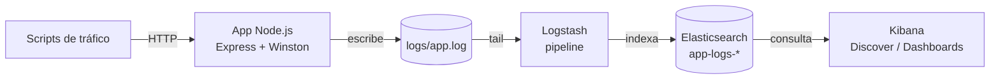
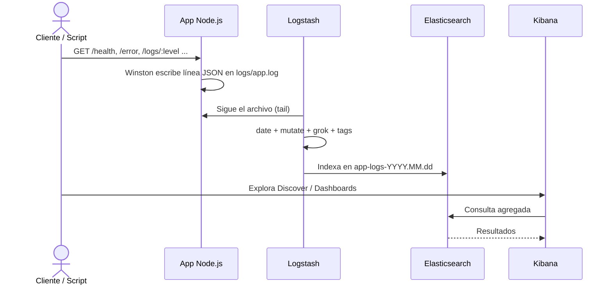

# Laboratorio ELK Stack — Arquitectura

> Vista de alto nivel de cómo está construido el sistema y cómo se reparten las
> responsabilidades. Para el stack real (versiones, librerías) ver
> [`stack.md`](stack.md). Para el propósito del proyecto ver
> [`../product/business-model.md`](../product/business-model.md).
>
> **Última actualización**: 2026-07-02

## Diagrama

## Componentes

| Componente        | Responsabilidad                                                        | Tecnología    |
| ----------------- | --------------------------------------------------------------------- | ------------- |
| App Node.js       | Expone endpoints HTTP y emite logs JSON estructurados a `logs/app.log` | Express + Winston |
| Volumen de logs   | Archivo compartido entre la app y Logstash vía volumen Docker         | `./logs`      |
| Logstash          | Lee el archivo, parsea el JSON, enriquece y envía a Elasticsearch      | Logstash 7.17 |
| Elasticsearch     | Almacena e indexa los logs en índices diarios `app-logs-YYYY.MM.dd`    | Elasticsearch 7.17 |
| Kibana            | Explora, visualiza y alerta sobre los logs                            | Kibana 7.17   |
| Scripts Bash      | Arranque, verificación de salud y simulación de tráfico               | Bash          |

## Decisiones clave

| Decisión                                | Razón                                                      |
| --------------------------------------- | ---------------------------------------------------------- |
| Ingesta por archivo (`file input`)      | Muestra el patrón clásico de agente que sigue un log       |
| Índices diarios (`app-logs-%{+YYYY.MM.dd}`) | Facilita retención y rotación por fecha                |
| `xpack.security.enabled=false`          | Simplifica el laboratorio local (ver [`auth.md`](auth.md)) |
| Single-node discovery                   | Un solo contenedor de Elasticsearch para bajo consumo      |

> El detalle de las decisiones relevantes se registra como ADRs en
> [`../decisions/`](../decisions/README.md).

## Reglas no negociables

- Los logs de la app **siempre** se emiten en JSON (una línea por evento) para que
  Logstash los parsee con el codec `json` sin grok frágil.
- Las tres imágenes de ELK comparten la **misma versión** (7.17.0).
- La app y Logstash comparten el mismo volumen `./logs`.

## Flujo principal

## Puertos expuestos

| Servicio      | Puerto host | Uso                          |
| ------------- | ----------- | ---------------------------- |
| App Node.js   | 5001        | API HTTP (5000 en contenedor)|
| Elasticsearch | 9200        | REST API / consultas         |
| Logstash      | 5044, 9600  | Beats input / API de monitoreo |
| Kibana        | 5601        | Interfaz web                 |

## Referencias

- [`stack.md`](stack.md) — stack tecnológico y versiones.
- [`api.md`](api.md) — endpoints de la app.
- [`database.md`](database.md) — esquema de los documentos de log en Elasticsearch.
- [`auth.md`](auth.md) — postura de seguridad del laboratorio.
- [`design.md`](design.md) — diseño de visualizaciones en Kibana.
- [`../conventions/`](../conventions/README.md) — convenciones de trabajo.
